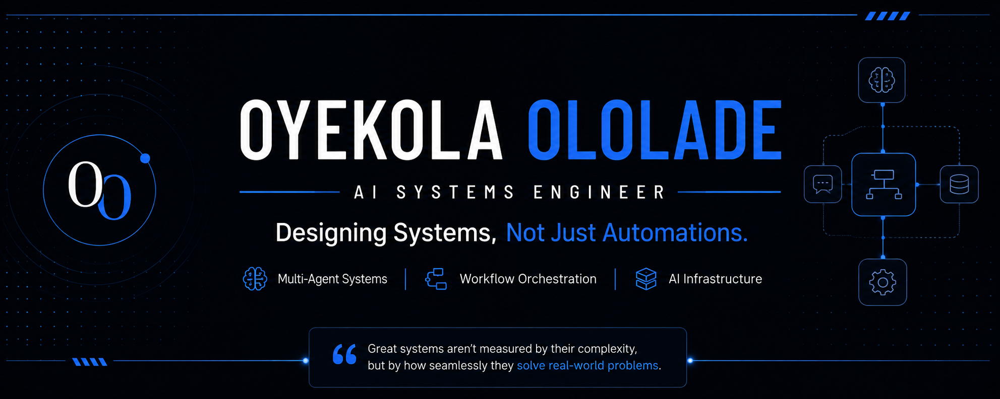

  

---
## Engineering Philosophy

I don't begin by asking **"What automation should we build?"**

I begin by asking **"What operational problem are we actually solving?"**

Every system I design starts with understanding the business, identifying operational bottlenecks, anticipating future constraints, and engineering software that remains reliable, maintainable, and scalable as complexity grows.

Technology is simply the implementation.

**The business problem always comes first.**

# About Me

I design and engineer AI systems that solve operational challenges not just automate individual tasks.

Every system I build begins with understanding the business itself. I analyze workflows, identify bottlenecks, anticipate operational constraints, and engineer reliable systems that continue delivering value as they grow.

My work combines AI, workflow orchestration, APIs, and scalable architectures to create intelligent software that businesses can depend on.

---

# Featured Systems

The projects below represent my approach to systems engineering—designing scalable AI solutions that solve real operational challenges rather than isolated automation tasks.

<table width="100%">
<tr>
<td>

### 🚀 FlowForge AVA
**AI Lead Operating System**

FlowForge AVA is a production-ready multi-agent AI platform engineered to automate the complete lead management lifecycle for modern businesses.

Rather than relying on a single AI assistant, FlowForge coordinates specialized AI agents responsible for customer engagement, lead qualification, appointment scheduling, CRM synchronization, and business operations—creating an intelligent system that operates as a unified workflow.

**Highlights**
- Multi-Agent AI Architecture
- Autonomous Lead Qualification
- WhatsApp Business Automation
- CRM Synchronization
- Google Calendar Scheduling
- Long-Term Conversation Memory
- Error Monitoring & Admin Alerting
- Modular Business Logic

**Technology**
`OpenAI API` • `n8n` • `Docker` • `WhatsApp Business API` • `Google Calendar API` • `Google Docs API` • `Airtable`

➡️ **Repository**: https://github.com/oyekola-ololade/FlowForge-Ava-AI

</td>
</tr>
</table>

 

<table width="100%">
<tr>
<td>

### 📧 MailIQ
**AI Email Intelligence Platform**

MailIQ is a multi-tenant SaaS platform that transforms incoming emails into structured, actionable intelligence.

Designed for businesses managing high communication volumes, the platform monitors Gmail and Outlook inboxes in real time, classifies messages using AI, generates contextual summaries, prioritizes urgency, and delivers results across WhatsApp, Telegram, Slack, and Discord within seconds.

Its architecture automatically provisions personalized AI agents for every customer, enabling scalable deployment without manual configuration.

**Highlights**
- Multi-Tenant SaaS Architecture
- AI Email Classification
- Intelligent Summarization
- OAuth 2.0 Authentication
- Subscription Management
- Automated AI Agent Provisioning
- Enterprise Workflow Automation

**Technology**
`OpenAI API` • `Python` • `n8n` • `Docker` • `Railway` • `OAuth 2.0` • `Paystack`

➡️ **Repository**: https://github.com/oyekola-ololade/Mail-IQ

</td>
</tr>
</table>

 

<table width="100%">
<tr>
<td>

### 📰 NewsIQ
**Enterprise AI News Intelligence Platform**

NewsIQ is an enterprise-scale AI system designed to automate the complete news production lifecycle.

The platform orchestrates a multi-stage pipeline that ingests information from multiple sources, performs normalization, AI clustering, editorial prioritization, verification, media enrichment, automated content generation, media production, distribution, analytics, and long-term memory management.

Its architecture was designed around centralized orchestration with fault-tolerant execution, ensuring failures within individual stages never interrupt the overall pipeline.

**Highlights**
- AI News Intelligence
- Multi-Stage Processing Pipeline
- Editorial Prioritization
- AI Content Generation
- Automated Media Production
- Distribution Automation
- Analytics Pipeline
- Long-Term Memory Architecture

**Technology**
`OpenAI API` • `Python` • `n8n` • `Docker` • `FFmpeg`

🚧 **Repository Coming Soon**

</td>
</tr>
</table>
---

# 🛠 Engineering Toolkit

## AI Engineering

- OpenAI API
- Prompt Engineering
- Multi-Agent Systems
- AI Memory Architecture

## Workflow & Orchestration

- n8n
- Make
- Zapier
- Workflow Orchestration
- AI Agent Orchestration
- Event-Driven Architecture
- Webhooks
- Retry Strategies

## Backend Engineering

- Python
- JavaScript
- REST APIs
- OAuth 2.0
- API Integrations
- JWT Authentication

## Data & Persistence

- PostgreSQL
- Supabase
- Airtable
- Data Modeling
- Vector Memory

## Infrastructure & DevOps

- Docker
- Railway
- Netlify
- Git
- GitHub

## Business Integrations

- WhatsApp Business API
- Evolution API
- Google Workspace APIs
- Microsoft Graph API
- Slack API
- Discord API
- Telegram Bot API
- Paystack

---

# 📖 Engineering Principles

- Solve the business problem before selecting the technology.
- Design systems, not isolated automations.
- Build for reliability, maintainability, and scale.
- Simplicity is an engineering advantage.
- Every operational bottleneck is a systems problem waiting to be understood.

---

# 🌱 Current Focus

- Engineering production-ready AI systems.
- Multi-agent architectures.
- Distributed AI systems.
- Cloud engineering.
- Scalable workflow orchestration.
- Continuously improving FlowForge AVA, MailIQ, and NewsIQ.

---

# 🧩 Additional Systems

Beyond my flagship systems, I've engineered AI-powered solutions across logistics, healthcare, education, customer experience, and content operations.

- 🚚 SwiftRoute Freight — Logistics & Shipment Automation
- 📝 AI Content Generation & Multi-Platform Scheduling
- 📊 AI Customer Feedback Intelligence Platform
- 🏥 Healthcare Appointment Booking & Reminder System
- 🎓 NextGen Academy Lead Qualification System
- 💬 Leadly — Multi-Tenant AI Chatbot SaaS Platform

---

# 📊 GitHub Analytics

---

# 🤝 Let's Connect

I'm always interested in discussing AI systems, software architecture, workflow orchestration, SaaS products, and engineering solutions that solve meaningful business problems.

- 💼 LinkedIn: https://www.linkedin.com/in/ololade-oyekola-5b1797397/
- 📧 Email: oyekolaololade6982@gmail.com

---

<i>"Great systems aren't measured by their complexity, but by how seamlessly they solve real-world problems."</i>

