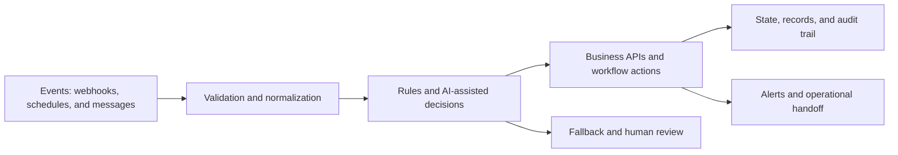
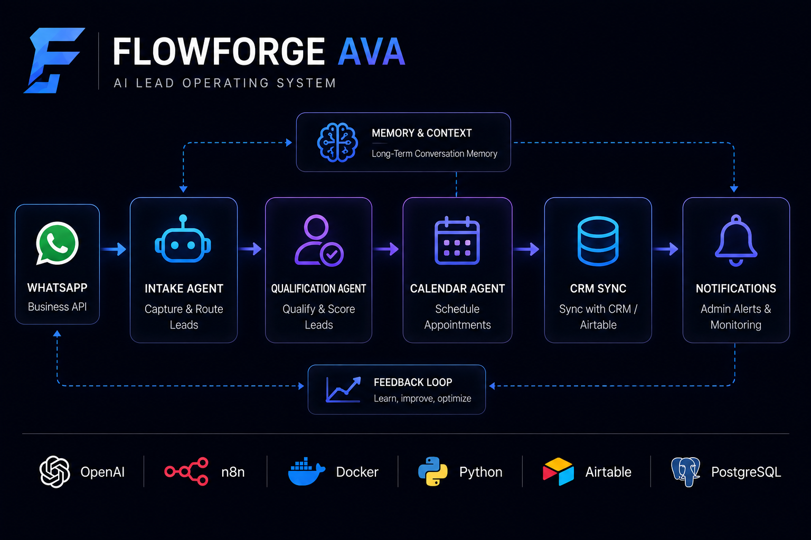
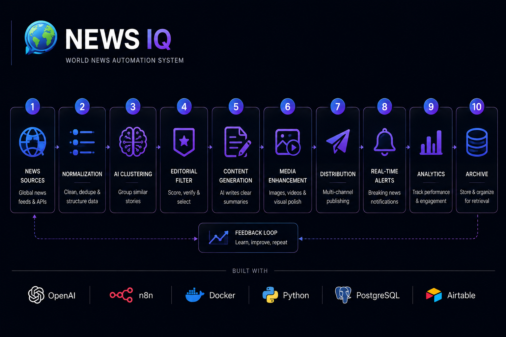

  

<h1 align="center">Oyekola Ololade</h1>

  <strong>AI Systems & Integration Engineer</strong> 
  Designing evidence-led n8n, API, data, and AI workflows with explicit validation, fallback, and human-review paths.

  
  
  

---

## What I Engineer

I begin with the operational problem: what enters the system, what decisions must be made, where state is stored, how failures surface, and when a person must remain in control.

My work focuses on:

- n8n workflow architecture, diagnosis, and repair
- API and webhook integrations
- AI-assisted classification, routing, and summarization
- Data validation, deduplication, and state handling
- Failure paths, alerts, fallbacks, and human review
- Clear implementation notes and handoff documentation

### Reference architecture pattern

This is the design pattern I use when reasoning about automation systems; individual repositories implement only the components shown in their own exports and documentation.

---

## Featured Systems

The status labels are deliberate: a verified build, working demo, offline prototype, partial MVP, and concept are not the same thing.

<table width="100%">
<tr>
<td>

### 🚀 FlowForge AVA
**Multi-Agent Lead & Customer Operations System**

**Evidence status:** Verified build with limitations

A real multi-agent workflow covering WhatsApp intake, validation, intent handling, memory, specialized agents, human handoff, CRM updates, calendar actions, and operational alerts.

**What it demonstrates**

- Multi-agent workflow orchestration
- Validation, routing, memory, and human handoff
- CRM, calendar, WhatsApp, and alert integrations
- Production-oriented architecture and documentation

**Current boundary:** Production readiness, guaranteed reliability, measurable ROI, and client outcomes are not claimed.

[Repository →](https://github.com/oyekola-ololade/FlowForge-Ava-AI)

</td>
</tr>
</table>

 

<table width="100%">
<tr>
<td>

### 🧑🏿‍💼 Candidate Screening
**Human-Reviewed Recruitment Workflow**

**Evidence status:** Working demo

A controlled recruitment demonstration covering structured candidate intake, extraction, duplicate detection, AI-assisted matching, scoring, database updates, and manual recruiter review.

**What it demonstrates**

- Structured document and candidate-data extraction
- Duplicate detection and controlled matching
- Scoring support with a human decision boundary
- Database updates and review workflow

**Current boundary:** This is not an autonomous hiring system, a production-compliance claim, or evidence of deployment at scale.

[Repository →](https://github.com/oyekola-ololade/cv-screening-automation)

</td>
</tr>
</table>

 

<table width="100%">
<tr>
<td>

### 📧 MailIQ
**Multi-Tenant Email Intelligence Prototype**

**Evidence status:** Prototype under repair · historical/offline

A substantial multi-tenant email-intelligence prototype designed around Gmail and Outlook monitoring, AI-assisted classification, and structured routing to WhatsApp, Telegram, Slack, and Discord.

**What it demonstrates**

- Multi-tenant workflow architecture
- Email monitoring and structured classification
- Messaging-channel routing
- Provisioning and subscription-system design work

**Current boundary:** MailIQ is offline, has no paying customers, and still has reliability gaps. It is not presented as a currently live or production-ready SaaS.

[Repository →](https://github.com/oyekola-ololade/Mail-IQ)

</td>
</tr>
</table>

 

<table width="100%">
<tr>
<td>

### 📰 NewsIQ
**AI News-Intelligence Pipeline**

**Evidence status:** Partial MVP

Real implementation work using Python, SQL, Docker/Railway, and five n8n workflows for an AI-assisted news-intelligence pipeline.

**What it demonstrates**

- Multi-stage processing and orchestration
- Python, SQL, Docker/Railway, and n8n integration
- Editorial prioritization and pipeline design
- Partial implementation beyond a written concept

**Current boundary:** NewsIQ is not a complete live ten-stage production system, and real social-platform publishing is not claimed.

[Repository →](https://github.com/oyekola-ololade/NewsIQ)

</td>
</tr>
</table>

 

<table width="100%">
<tr>
<td>

### 🚚 SwiftRoute
**Freight Order Control & Audit API**

**Evidence status:** Early implementation · locally tested

A working Python vertical slice for validated freight-order intake, idempotent creation, controlled supervisor approval or rejection, SQLite persistence, and transactional audit events.

**What it demonstrates**

- Standard-library Python HTTP API design
- Idempotency and conflicting-request protection
- Controlled state transitions with human review
- Atomic order and audit-event persistence
- Unit, HTTP integration, concurrency, and synthetic stress testing

**Current boundary:** SwiftRoute is not deployed, does not process real shipments, and does not yet include authentication, PostgreSQL, courier integrations, notifications, payments, or a customer portal.

[Repository →](https://github.com/oyekola-ololade/SwiftRoute)

</td>
</tr>
</table>

 

<table width="100%">
<tr>
<td>

### 🧩 30-Workflow n8n Template Library
**Sanitized Automation Portfolio**

**Evidence status:** Portfolio/template assets

Thirty individual repositories with importable workflow JSON, setup instructions, visual HTML project pages, and repository-specific Mermaid architecture diagrams.

**What it demonstrates**

- Workflow decomposition across sales, support, ecommerce, reporting, and operations
- API, webhook, routing, validation, and AI-assisted patterns
- Sanitized configuration and handoff documentation
- Clear architecture and buyer-readable use cases

**Current boundary:** Credentials and service identifiers are placeholders. Configured live-run videos are not included yet, and the templates are not claimed as production deployments.

[Browse all repositories →](https://github.com/oyekola-ololade?tab=repositories)

</td>
</tr>
</table>

> **Concept boundary:** ChatIQ/Leadly and MINT remain concepts or specifications. They are not presented as completed client work, deployed systems, or revenue-generating products.

---

## n8n Template Library

Each template repository includes a sanitized workflow export, setup instructions, a visual HTML project page, and a Mermaid architecture diagram. They are portfolio/template assets and require the user's own credentials, service identifiers, configuration, and testing before use.

### Priority proof repositories

1. [WhatsApp Lead AI Scoring → Slack](https://github.com/oyekola-ololade/whatsapp-lead-ai-scoring-slack)
2. [Website Form Qualification → Calendar](https://github.com/oyekola-ololade/website-form-qualification-calendar)
3. [Email Ticket Auto-Router](https://github.com/oyekola-ololade/email-ticket-autorouter)
4. [Shopify Invoice → Email + WhatsApp](https://github.com/oyekola-ololade/shopify-invoice-email-whatsapp)
5. [Multi-Channel Inquiry Unifier](https://github.com/oyekola-ololade/multi-channel-inquiry-unifier)

The remaining repositories cover lead operations, customer support, reporting, ecommerce operations, content workflows, data cleanup, and internal task routing. Browse them from the [repositories tab](https://github.com/oyekola-ololade?tab=repositories).

---

## Engineering Toolkit

  

- **Workflow orchestration:** n8n, Make, webhooks, scheduled and event-driven workflows
- **Software and data:** Python, JavaScript, SQL, PostgreSQL, Supabase
- **Infrastructure:** Docker, Railway, Git, GitHub
- **Integrations:** WhatsApp, Slack, Google Workspace, Airtable, Telegram, Discord, and REST APIs
- **AI workflow patterns:** classification, structured extraction, summarization, routing, scoring support, and human-review controls

---

## Engineering Principles

> Solve the business problem before choosing the technology.

- Claims should match inspectable evidence.
- Generated or importable workflows are not production-tested by default.
- AI-assisted decisions need validation, fallback behavior, and appropriate human control.
- State, failure handling, observability, and handoff are part of the system—not optional polish.
- Simplicity is an engineering advantage when it improves reliability and maintenance.

---

## Current Focus

- Diagnosing and repairing n8n/API workflow failures
- Building bounded integration systems with testable acceptance criteria
- Improving state handling, error paths, and operational documentation
- Converting existing technical work into truthful, buyer-readable proof

---

## GitHub Activity

  
  

---

## Contact

For a bounded workflow diagnostic, repair, or integration discussion:

- [LinkedIn](https://www.linkedin.com/in/ololade-oyekola-5b1797397/)
- [Email](mailto:oyekolaololade69@gmail.com)

  <i>Engineering systems that make their evidence, boundaries, and failure paths visible.</i>

