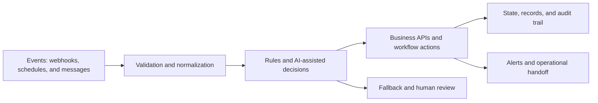

  

<h1 align="center">Oyekola Ololade</h1>

  <strong>AI Systems & Integration Engineer</strong> 
  Designing evidence-led n8n, API, data, and AI workflows with explicit validation, fallback, and human-review paths.

  
  
  

---

## What I Engineer

I begin with the operational problem: what enters the system, what decisions must be made, where state is stored, how failures surface, and when a person must remain in control.

My work focuses on:

- n8n workflow architecture, diagnosis, and repair
- API and webhook integrations
- AI-assisted classification, routing, and summarization
- Data validation, deduplication, and state handling
- Failure paths, alerts, fallbacks, and human review
- Clear implementation notes and handoff documentation

### Reference architecture pattern

This is the design pattern I use when reasoning about automation systems; individual repositories implement only the components shown in their own exports and documentation.

---

## Portfolio Evidence

The status labels below are deliberate. A template, demo, prototype, and production deployment are not the same thing.

| System | Evidence status | What the repository or project demonstrates | Current limitation |
|---|---|---|---|
| [FlowForge AVA](https://github.com/oyekola-ololade/FlowForge-Ava-AI) | **Verified build with limitations** | Multi-agent lead and customer-operations flow with WhatsApp intake, validation, intent handling, memory, specialized agents, human handoff, CRM, calendar, and alerts | Production readiness and measurable business outcomes are not claimed |
| [Candidate Screening](https://github.com/oyekola-ololade/cv-screening-automation) | **Working demo** | Structured intake, extraction, duplicate detection, controlled AI matching, scoring, database update, and recruiter review | Demonstration only; not an autonomous hiring or production-compliance system |
| [MailIQ](https://github.com/oyekola-ololade/Mail-IQ) | **Prototype under repair · historical/offline** | Substantial multi-tenant email-intelligence architecture for Gmail/Outlook monitoring and structured routing to messaging channels | Offline, no paying customers, and reliability gaps remain |
| NewsIQ | **Partial MVP** | Python, SQL, Docker/Railway, and five n8n workflows for an AI news-intelligence pipeline | Not a complete live production or social-publishing system |
| [30-workflow template library](#n8n-template-library) | **Sanitized portfolio templates** | Importable n8n workflow JSON, setup notes, visual pages, and repository-specific architecture diagrams | Credentials are placeholders and configured live-run videos are not included yet |
| SwiftRoute | **Concept / specification** | Logistics-system architecture and product thinking | Not client work, a deployment, or evidence of measured outcomes |

---

## n8n Template Library

Each template repository includes a sanitized workflow export, setup instructions, a visual HTML project page, and a Mermaid architecture diagram. They are portfolio/template assets and require the user's own credentials, service identifiers, configuration, and testing before use.

### Priority proof repositories

1. [WhatsApp Lead AI Scoring → Slack](https://github.com/oyekola-ololade/whatsapp-lead-ai-scoring-slack)
2. [Website Form Qualification → Calendar](https://github.com/oyekola-ololade/website-form-qualification-calendar)
3. [Email Ticket Auto-Router](https://github.com/oyekola-ololade/email-ticket-autorouter)
4. [Shopify Invoice → Email + WhatsApp](https://github.com/oyekola-ololade/shopify-invoice-email-whatsapp)
5. [Multi-Channel Inquiry Unifier](https://github.com/oyekola-ololade/multi-channel-inquiry-unifier)

The remaining repositories cover lead operations, customer support, reporting, ecommerce operations, content workflows, data cleanup, and internal task routing. Browse them from the [repositories tab](https://github.com/oyekola-ololade?tab=repositories).

---

## Engineering Toolkit

  

- **Workflow orchestration:** n8n, Make, webhooks, scheduled and event-driven workflows
- **Software and data:** Python, JavaScript, SQL, PostgreSQL, Supabase
- **Infrastructure:** Docker, Railway, Git, GitHub
- **Integrations:** WhatsApp, Slack, Google Workspace, Airtable, Telegram, Discord, and REST APIs
- **AI workflow patterns:** classification, structured extraction, summarization, routing, scoring support, and human-review controls

---

## Engineering Principles

> Solve the business problem before choosing the technology.

- Claims should match inspectable evidence.
- Generated or importable workflows are not production-tested by default.
- AI-assisted decisions need validation, fallback behavior, and appropriate human control.
- State, failure handling, observability, and handoff are part of the system—not optional polish.
- Simplicity is an engineering advantage when it improves reliability and maintenance.

---

## Current Focus

- Diagnosing and repairing n8n/API workflow failures
- Building bounded integration systems with testable acceptance criteria
- Improving state handling, error paths, and operational documentation
- Converting existing technical work into truthful, buyer-readable proof

---

## GitHub Activity

  
  

---

## Contact

For a bounded workflow diagnostic, repair, or integration discussion:

- [LinkedIn](https://www.linkedin.com/in/ololade-oyekola-5b1797397/)
- [Email](mailto:oyekolaololade69@gmail.com)

  <i>Engineering systems that make their evidence, boundaries, and failure paths visible.</i>

