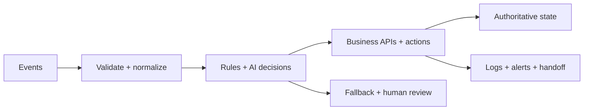

  

<h1 align="center">Oyekola Ololade</h1>

  <strong>AI Systems & Automation Engineer</strong> 
  Building and repairing n8n, API, data, and AI systems with explicit state, validation, failure handling, and human-review boundaries.

  
  
  

---

## What I Engineer

I start with the operating problem: what enters the system, which decisions are deterministic, where state is authoritative, what can fail, how failure becomes visible, and when a person must remain in control.

My work focuses on:

- n8n workflow architecture, diagnosis, and repair
- REST APIs, webhooks, OAuth, and third-party integrations
- AI-assisted classification, routing, extraction, and summarization
- state handling, idempotency, validation, and deduplication
- retries, alerts, fallbacks, and human handoff
- deployment, testing, documentation, and operational handoff

---

## Featured Systems

The labels below are evidence labels, not marketing labels. A verified build, offline prototype, partial MVP, local implementation, and template draft are different things.

### 🚀 FlowForge AVA — Multi-Agent Lead & Customer Operations

**Evidence status:** Verified build with limitations

A multi-agent n8n workflow covering WhatsApp-style intake, validation, intent handling, conversation memory, specialist-agent coordination, CRM updates, calendar actions, human handoff, and operational alerts.

**Strongest proof:** multi-agent orchestration, state-aware conversation flow, tool/API integration, CRM/calendar actions, and inspectable workflow evidence.

**Boundary:** no claim of full production readiness, measured ROI, client-scale reliability, or verified business outcomes.

[Repository →](https://github.com/oyekola-ololade/FlowForge-Ava-AI)

---

### 📧 MailIQ — Multi-Tenant Email Intelligence Prototype

**Evidence status:** Historical/offline prototype under repair

A substantial multi-tenant email-intelligence system designed around Gmail and Outlook ingestion, AI classification, tenant-aware routing, OAuth lifecycle handling, provisioning, billing, and multi-channel delivery.

**Strongest proof:** system decomposition, multi-tenant workflow architecture, provider lifecycle design, state/reliability analysis, and sanitized workflow evidence.

**Boundary:** currently offline, no paying customers, and not presented as a live or production-ready SaaS.

[Repository →](https://github.com/oyekola-ololade/Mail-IQ)

---

### 🚚 SwiftRoute — Freight Order Control & Audit API

**Evidence status:** Early implementation · locally tested

A working Python vertical slice for freight-order intake, idempotent creation, controlled supervisor approval/rejection, SQLite persistence, and transactional audit events.

**Strongest proof:** deterministic API behavior, idempotency, controlled state transitions, unit/integration tests, concurrency checks, and synthetic stress testing.

**Boundary:** not deployed and does not process real shipments. Authentication, PostgreSQL, courier integrations, notifications, payments, and a customer portal remain outside the implemented slice.

[Repository →](https://github.com/oyekola-ololade/SwiftRoute)

---

### 📰 NewsIQ — AI News-Intelligence Pipeline

**Evidence status:** Partial MVP

Implementation work using Python, PostgreSQL/pgvector, Docker/Railway configuration, and five n8n workflow exports for ingestion, research, script generation, media orchestration, and controlled distribution.

**Strongest proof:** multi-stage orchestration, Python + SQL + n8n integration, retrieval/context handling, and explicit safety boundaries around unimplemented publishing.

**Boundary:** not a complete live ten-stage production system; configured end-to-end operation and real social publishing are not claimed.

[Repository →](https://github.com/oyekola-ololade/NewsIQ)

---

### 🧑🏿‍💼 Candidate Screening — Human-Reviewed Recruitment Workflow

**Evidence status:** Working demo

A bounded workflow demonstration covering candidate intake, extraction, duplicate detection, AI-assisted matching/scoring, database updates, and manual recruiter review.

**Strongest proof:** structured extraction, deterministic checks around AI assistance, duplicate handling, and an explicit human-decision boundary.

**Boundary:** not an autonomous hiring system, production-compliance claim, or scale/deployment claim.

[Repository →](https://github.com/oyekola-ololade/cv-screening-automation)

---

## 30-Workflow n8n Template Archive

**Evidence status:** Template drafts under validation — not core proof

There are thirty smaller workflow repositories covering sales, support, ecommerce, reporting, content, data cleanup, and internal operations. They contain sanitized JSON exports, setup notes, HTML pages, and Mermaid diagrams.

A September 2026 audit found that the library should **not** be presented as thirty validated working automations. Some exports contain stale provider assumptions or workflow-logic defects that require repair before configured use. For example, the LinkedIn publishing template still referenced the legacy `ugcPosts` integration pattern and contained a pseudo-wait rather than a real delayed execution path; another segmentation template contains invalid three-way branching from an n8n IF node.

Until each template passes import, connection-graph, expression, API-version, and configured execution checks, the library is treated as an **engineering/template archive**, not production evidence.

[Browse repositories →](https://github.com/oyekola-ololade?tab=repositories)

---

## Engineering Toolkit

  

- **Workflow orchestration:** n8n, Make, webhooks, scheduled and event-driven workflows
- **Software and data:** Python, JavaScript, SQL, PostgreSQL, Supabase
- **Infrastructure:** Docker, Railway, Git, GitHub
- **Integrations:** WhatsApp, Slack, Google Workspace, Airtable, Telegram, Discord, and REST APIs
- **AI workflow patterns:** classification, extraction, summarization, routing, scoring support, tool use, and human-review controls

---

## Engineering Principles

- Claims should match inspectable evidence.
- Importable JSON is not the same as a verified working workflow.
- AI should not own deterministic business truth when exact rules can own it.
- State, failure handling, observability, and handoff belong in the architecture.
- Human review is a feature when consequence or uncertainty requires it.
- Simplicity is an engineering advantage when it improves reliability and maintenance.

[Read the engineering manifesto →](https://github.com/oyekola-ololade/engineering-manifesto)

---

## Current Focus

- Diagnosing and repairing n8n/API workflow failures
- Building bounded integration systems with testable acceptance criteria
- Improving state handling, error paths, and operational documentation
- Converting real implementation work into truthful buyer-readable proof

---

## Contact

For workflow diagnostics, automation repair, integration work, or AI-system implementation:

- [LinkedIn](https://www.linkedin.com/in/ololade-oyekola-5b1797397/)
- [Email](mailto:oyekolaololade69@gmail.com)

<i>Engineering systems that make their evidence, boundaries, state, and failure paths visible.</i>

